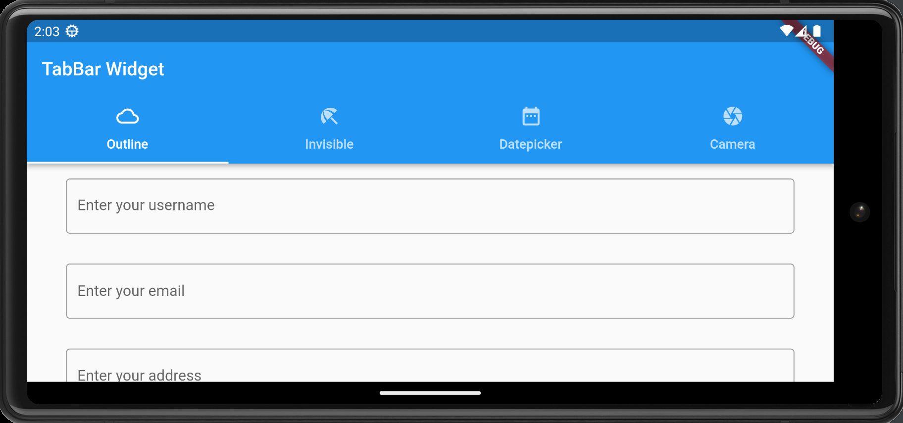
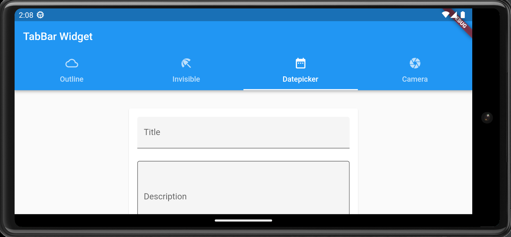
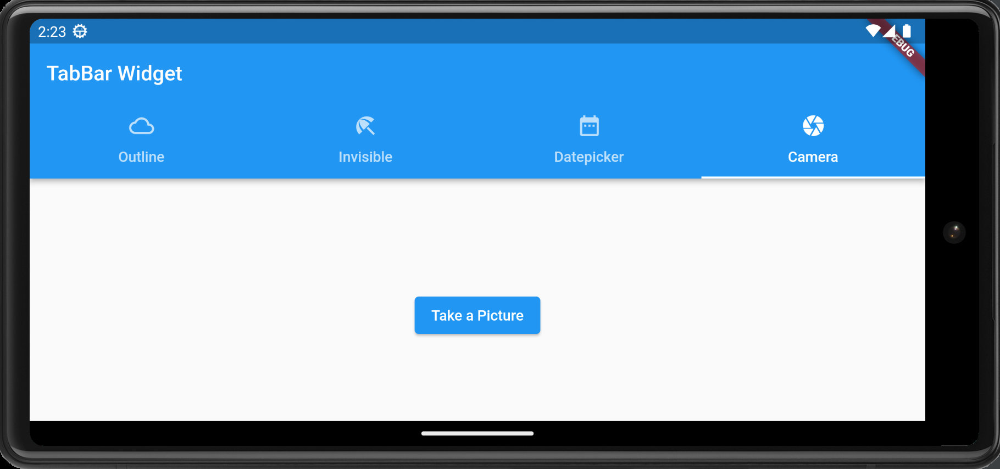

# Askui automation example with Flutter
This repository contains examples of using [askui](https://www.askui.com/) to automate an android app built with [Flutter](https://flutter.dev/). To run the example, setup the provided demo app by following the instruction. This example assumes that you already have the [Android Emulator](https://developer.android.com/studio/run/emulator) installed.

Available examples include:
- Click/Touch automation
- Type automation
- Swipe automation

#### Live demo in action (playback speed x3)


## Instruction

### 1. Setup Flutter demo app
1. [Install Flutter](https://docs.flutter.dev/get-started/install)
2. Clone this repository and run `flutter create demo_app` within the directory:
```bash
git clone https://github.com/askui/flutter-example-automation;
cd flutter-example-automation;
flutter create demo_app;
```
2. Install dependencies for the Flutter demo app:
```bash
# run this command inside your flutter project directory
flutter pub add camera intl;
```
3. In order to use the camera, we need to set the `minSdkVersion` in `android/app/build.gradle`:
```groovy
// inside the 'android/app/build.gradle' set the 'minSdkVersion' to 21
    defaultConfig {
        ...
        minSdkVersion 21
        ...
    }
```
4. (optional) The app is ready to be built, but it will throw deprecation warnings. If you want to clear the deprecation warnings, follow this step. [See this issue](https://github.com/flutter/flutter/issues/89578#issuecomment-945916643)
```yaml
# change the respective part inside the 'pubspec.yaml'
dependencies:
  camera:
    git:
      url: https://github.com/flutter/plugins
      path: packages/camera/camera
      ref: 9e46048ad2e1f085c1e8f6c77391fa52025e681f
```

5. [Run the Android Emulator](https://developer.android.com/studio/run/emulator)

6. Run the demo app:
 ```bash
flutter run;
 ```

7. **Set the device to landscape mode**. askui currently works only with landscape mode, meaning that the width of the captured image should be bigger than the height. If you test in portrait mode, then it will run into an issue.

Now you should see the demo app running on your android device.


### 2. Setup ADBKeyboard
In this example, we are going to automate the typing in the android device. In order to let askui fluently type as desired, we will use a virtual keyboard that handles the keyboard input via adb: [ADBKeyboard.apk](https://github.com/senzhk/ADBKeyBoard)

1. Download the ADB-Keyboard package *(Important: Version 2.0)*: <br>[Link to Github Repo](https://github.com/senzhk/ADBKeyBoard/releases/tag/v2.0)
2. Unzip it.
3. Find your device:
```bash
# make sure that your android device is connected, and the USB debugging mode is enabled.
adb devices;
```
4. Install the ADBkeyboard on the device:
```bash
# inside ADBKeyBoard-2.0/
adb -s <your device id> install ADBKeyboard.apk;
```
5. Configure the ADB Keyboard:
```bash
# inside ADBKeyBoard-2.0/
adb -s <your device id> shell settings put secure default_input_method com.android.adbkeyboard/.AdbIME;
```
6. Enable the ADB Keyboard:
```bash
# inside ADBKeyBoard-2.0/
adb -s <your device id> shell ime enable com.android.adbkeyboard/.AdbIME
```
7. To check if it is enabled: <br>Click on a textfield in an app and see if the `ADB Keyboard {ON}` notification is shown at the bottom of the screen.


### 3. Setup askui
1. Setup askui by following [these steps](https://docs.askui.com/docs/general/Getting%20Started/getting-started).
2. We need to run the uiController directly with an extra argument to specify the runtime mode, as the current version of askui(ver. 0.3.2) doesn't provide the api for running it with the runtime argument yet. <br><br>From within your npm project path, go to the directory that contains the askui-ui-controller binary, and run `./askui-ui-controller -r android` with an optional argument for the android runtime:
```bash
cd <YOUR_PROJECT_DIRECTORY>/node_modules/askui/dist/release/latest/<YOUR_PLATFORM>
./askui-ui-controller -r android;

# for example, Mac OS
cd node_modules/askui/dist/release/latest/darwin/askui-ui-controller.app/Contents/MacOS/
./askui-ui-controller -r android;
```
*If you can't find the binary as described above, then you might have askui freshly installed and haven't run it yet. The binary gets downloaded as the askui test code runs. [See here](https://docs.askui.com/docs/general/Getting%20Started/writing-your-first-test/#run)*

3. If you got them both(emulator and uiController) running, then we are ready to go for the UI automation.<br><br>If you are working with the test code from our [official docs](https://docs.askui.com/docs/general/Getting%20Started/writing-your-first-test/), then you need to deactivate few lines of the code in `test/helper/jest.setup.ts` that is running the uiController, since we are already running it manually in the previous step.
```ts
// file location: test/helper/jest.setup.ts
// comment out every line that uses uiController

import { UiControlClient, UiController } from 'askui';

// uiController: UiController;

let aui: UiControlClient;

jest.setTimeout(60 * 1000 * 60);

beforeAll(async () => {
//   uiController = new UiController({
//     /**
//      * Select the display you want to run your tests on, display 0 is your main display;
//      * ignore if you have only one display
//      */
//     display: 0,
//   });

//   await uiController.start();

  aui = await UiControlClient.build({
    credentials:{
        workspaceId: 'YOUR_WORKSPACEID_FROM_USER_PORTAL',
        token: 'YOUR_TOKEN_FROM_USER_PORTAL',
    }
  });

  await aui.connect();
});

afterAll(async () => {
//   await uiController.stop();

  aui.close();
});

export { aui };
```
4. Use the test code `askui-test/demo-automation.ts` provided in this repository.
5. Run the askui test code:
```bash
npx jest test/my-first-askui-test-suite.test.ts --config ./test/jest.config.ts;
```

--------
## Breakdown: askui test demo code 

This chapter will walk you through the provided `askui-test/demo-automation.ts` step by step.
The test is divided into three parts, and each test is run for each tabs within the demo app:
- Outline tab
    - Find a textfield and type in characters.
    - Find a button and press it.
- Datepicker tab
    - Select a desired date within the date picker widget.
- Camera tab
    - Open the camera and push the record button.

General tips for using askui as a more friendly tool:
1. **Try to annotate** : Use `await aui.annotateInteractively();` or `await aui.annotate();` in order to see how askui is understanding the visible elements on your screen. By using `await aui.annotate()`, the result of the annotation will be saved in `report/` as an HTML file.
2. **Be aware of the screen size of your device** : As askui understands your application based on the screen shown and captured, in some occasions, you may want to know your screen size in order to e.g. properly scroll or swipe within your application. You may need to change the numbers for the `input swipe` command within the provided test code, so that it suits the screen size of your device.
3. **Try to recognise the elements by text** : 


### 1. Click and Type
The test code is within the `askui-test/demo-automation.ts`. Copy and paste the code into your askui test code.
- We start the test automation from the very first tab of our demo-app.

*image: First tab of the demo-app*
- In order to type into a textfield, we first need to get the focus on the desired textfield. We can achieve it by running the code below:
```ts
         // First, get the focus on the textfield that has a hint saying 'Enter your username'
        await aui.click().text().withText('Enter your username').exec();
        // Then, type the desired text
        await aui.type('askui').exec();
```

- As we have multiple of textfields in our demo app, we can iterate the same procedure for each of them.
Notice that we have to scroll down the page before we can see the next textfield:
```ts
        // Click and type the username
        await aui.click().text().withText('Enter your username').exec();
        await aui.type('askui').exec();
        // Click and type the email address
        await aui.click().text().withText('Enter your email').exec();
        await aui.type('askui@askui.com').exec();
        // Scroll down the page
        // execOnShell() can run shell commands within the device via adb
        await aui.execOnShell('input swipe 300 600 300 300').exec();
        // Click and type the address
        await aui.click().text().withText('Enter your address').exec();
        await aui.type('Haid-und-Neu-Straße 18').exec();
        // Pressing enter is the equivelant to pressing the return button on the on-screen-keyboard
        // This gets rid of the focus from the textfield
        await aui.pressAndroidKey('enter').exec();
```
*tip: `input` is a shell command installed within android devices, and can evoke input events. The syntax of the `input swipe` option is: ```input swipe <startX> <startY> <endX> <endY>```*

- After filling up the textfields, we can push the buttons at the bottom of the page:
```ts
        // Press the 'Submit' button
        await aui.click().button().contains().text().withText('Submit').exec();
        // We will have a popup window that has two buttons. Press the 'Refuse' button
        await aui.click().text().withText('Refuse').exec();
        // We scroll down further in order to see more buttons
        await aui.execOnShell('input swipe 300 600 300 300').exec();
        await aui.execOnShell('input swipe 300 600 300 300').exec();
        
        // Here we press multiple of toggle buttons one by one
        await aui.click().text().withText('Banana').exec();
        await aui.click().text().withText('Mango').exec();
        await aui.click().text().withText('Sunny').exec();
        await aui.click().text().withText('Rainy').exec();
        await aui.click().text().withText('Windy').exec();

        // Let's go to the next test page by using horisontal swipe!
        // Here we swipe two times in a row
        await aui.execOnShell('input swipe 1500 600 300 600').exec();
        await aui.execOnShell('input swipe 1500 600 300 600').exec();
```

### 2. Datepicker
- After running the test code above, we should see the demo app swiped to the `Datepicker` tab.

*image: Datepicker tab of the demo app*

- First, we scroll the page down in order to see the date picker widget.
```ts
        // This code block is to type text into the textfields. 
        // Skip this part if not desired.
        await aui.click().text().withText('Title').exec();
        await aui.type('My vacation plan').exec();
        await aui.execOnShell('input swipe 300 600 300 300').exec();
        await aui.click().text().withText('Description').exec();
        await aui.type('0. Drink a lot of water').exec();
        await aui.pressAndroidKey('tab').exec();

        // Here we scroll the page in order to see the date picker.
        await aui.execOnShell('input swipe 300 600 300 200').exec();
```

- After running the test code above, we should see two different date picker widgets that is represented with `edit` button

```ts
        // Pick a date
        // Select the Depature date
        await aui.click().text().withText('edit').nearestTo().text().withText('Depature').exec(); // this will open up the calendar
        await aui.click().icon().withText('chevron right').exec(); // within the calendar, we push the > icon on the top right corner
        await aui.click().icon().withText('chevron right').exec();
        await aui.click().text().withText('20').exec(); // select 20
        await aui.click().text().withText('ok').exec(); // then, press OK

        // Select the Return date
        await aui.click().text().withText('edit').nearestTo().text().withText('Return').exec();
        await aui.click().icon().withText('chevron right').exec();
        await aui.click().icon().withText('chevron right').exec();
        await aui.click().icon().withText('chevron right').exec();
        await aui.click().text().withText('5').exec();
        await aui.click().text().withText('ok').exec();
```

- Let's go further below to the bottom of the page, and then interact with more interfaces.
```ts
        // scroll down the page
        await aui.execOnShell('input swipe 300 600 300 500').exec();

        // click and check the checkbox
        await aui.click().checkboxUnchecked().nearestTo().text().withText('Brushed Teeth').exec();
        // finally, we turn on the switch
        await aui.click().switchDisabled().nearestTo().text().withText('Enable feature').exec();
```

### 3. Take a picture with the camera
- In the final tab `Camera`, we can launch the device's camera and take a picture by pressing the record button.

```ts
        // Press the button. This will launch the camera
        await aui.click().button().contains().text().withText('Take a Picture').exec();
        // Within the camera app, we press the white circular button, in order to capture a picture
        await aui.click().icon().containsText('circle').exec();
```

### 4. Complete test code
This is the complete test code that runs askui to automate our test:
```ts
import { aui } from './helper/jest.setup';

describe('jest with askui', () => {
    xit('should annotate', async () => {
        await aui.annotateInteractively();
        // or
        //await aui.annotate();
    });

    it('should fill up the textfields and push buttons', async () => {
        await aui.click().text().withText('Enter your username').exec();
        await aui.type('askui').exec();
        await aui.click().text().withText('Enter your email').exec();
        await aui.type('askui@askui.com').exec();
        await aui.execOnShell('input swipe 300 600 300 300').exec();
        await aui.click().text().withText('Enter your address').exec();
        await aui.type('Haid-und-Neu-Straße 18').exec();
        await aui.pressAndroidKey('enter').exec();
        await aui.click().button().contains().text().withText('Submit').exec();
        await aui.click().text().withText('Refuse').exec();
        await aui.execOnShell('input swipe 300 600 300 300').exec();
        await aui.execOnShell('input swipe 300 600 300 300').exec();
        

        await aui.click().text().withText('Banana').exec();
        await aui.click().text().withText('Mango').exec();
        await aui.click().text().withText('Sunny').exec();
        await aui.click().text().withText('Rainy').exec();
        await aui.click().text().withText('Windy').exec();

        await aui.execOnShell('input swipe 1500 600 300 600').exec();
        await aui.execOnShell('input swipe 1500 600 300 600').exec();
    
    });


    it('should pick the dates', async () => {

        await aui.click().text().withText('Title').exec();
        await aui.type('My vacation plan').exec();
        await aui.execOnShell('input swipe 300 600 300 300').exec();
        await aui.click().text().withText('Description').exec();
        await aui.type('0. Drink a lot of water').exec();
        await aui.pressAndroidKey('tab').exec();

        await aui.execOnShell('input swipe 300 600 300 200').exec();
        


        // Pick a date
        // Depature date
        await aui.click().text().withText('edit').nearestTo().text().withText('Depature').exec();
        await aui.click().icon().withText('chevron right').exec();
        await aui.click().icon().withText('chevron right').exec();
        await aui.click().text().withText('20').exec();
        await aui.click().text().withText('ok').exec();

        // Return date
        await aui.click().text().withText('edit').nearestTo().text().withText('Return').exec();
        await aui.click().icon().withText('chevron right').exec();
        await aui.click().icon().withText('chevron right').exec();
        await aui.click().icon().withText('chevron right').exec();
        await aui.click().text().withText('5').exec();
        await aui.click().text().withText('ok').exec();

        await aui.execOnShell('input swipe 300 600 300 500').exec();

        await aui.click().checkboxUnchecked().nearestTo().text().withText('Brushed Teeth').exec();
        await aui.click().switchDisabled().nearestTo().text().withText('Enable feature').exec();

        await aui.execOnShell('input swipe 1500 600 300 600').exec();

    });

    it('should take a picture', async ()=>{
        await aui.click().button().contains().text().withText('Take a Picture').exec();
        await aui.click().icon().containsText('circle').exec();
    });
});
```